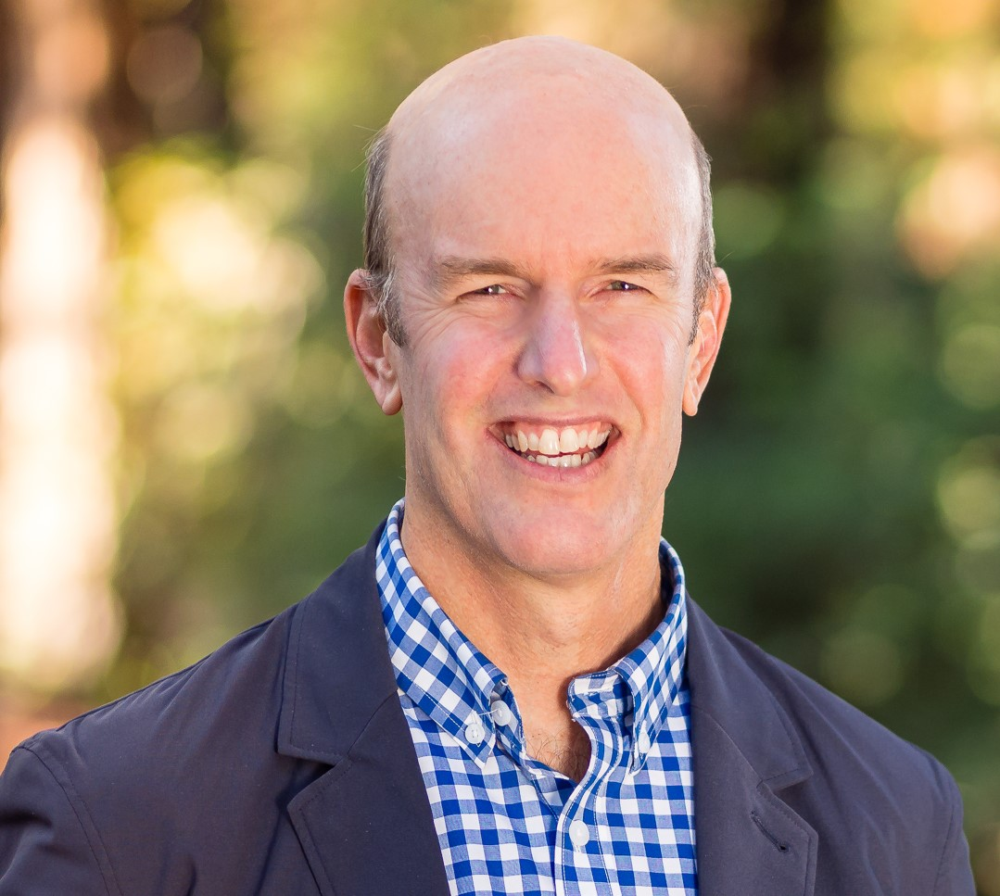

# Author

Vance Russell has nearly 40 years of experience working in forest science & management, rewilding, 
biodiversity conservation, agricultural landscapes, restoration, and natural resources management. He is a conservation consultant and works for various non-profit, state/federal agencies, and private businesses. Vance was the California Director of Programs for the National Forest Foundation, where he managed, led, and funded community forestry projects. Before joining the National Forest Foundation, he was director of Audubon California’s Landowner Stewardship Program, working with farmers and ranchers to restore habitat compatible with existing agricultural operations. He managed the 7,800-acre Bobcat Ranch and 3,000-acre Mayacamas Mountains Reserve in Yolo and Sonoma Counties, California. Vance is the former Board Chair of Groundswell International, is a trustee for the South Downs National Park Trust, and serves on the Rewilding Leadership Council for the Rewilding Institute. Vance received his M.S. degree in Forest Science and Natural Resources Management from Cornell University and a B.A. in Biology from the College of Wooster.

[Linkedin](https://www.linkedin.com/in/vance-russell-ab596810/)

[Website](https://vrconservation.github.io/)
